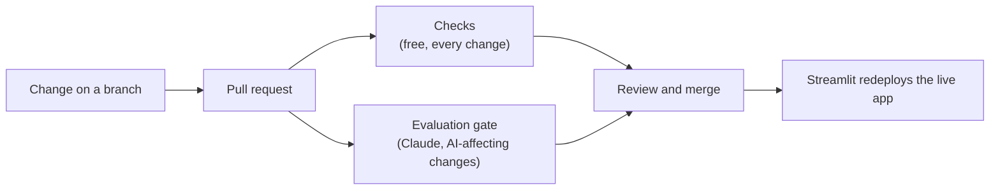

# Invoice Extractor

Turns messy invoices (any layout, digital PDFs or scans) into clean, structured data using Claude. Every
result is **scored against an answer key**, **costed per invoice**, and compared with a traditional
rule-based approach. Uncertain invoices go to a **human review queue**.

**Live demo:** https://invoice-extractor-bvd2cdqre4pbrydbdrwmeq.streamlit.app/

[](https://github.com/stevenmunson/Invoice-Extractor/actions/workflows/checks.yml)

---

## Results

60 synthetic invoices: a **practice set** (30 invoices, 6 layouts) used for tuning, and a **held-out test
set** (30 different invoices, including 2 layouts the practice set never shows) scored once at the end.
10 fields per invoice: vendor, invoice #, invoice date, due date, bill-to, currency, subtotal, tax,
total and line items.

| Method | Practice set | Held-out test set | Flagged for review (test) | Cost per invoice |
|---|---|---|---|---|
| Rule-based (text + pattern matching, no AI) | 44% of fields · 0/30 perfect | 34% of fields · 0/30 perfect | n/a, never flags | $0 |
| Claude Haiku 4.5 | 100% · 30/30 perfect | 100% · 30/30 perfect | 3, all false alarms | ~$0.004 |
| **Claude Sonnet 5.5** | **100% · 30/30 perfect** | **100% · 30/30 perfect** | **0** | **~$0.012** |

That's roughly **$4 vs. $12 per 1,000 invoices**, against an estimated ~$4,700/month to key 2,000 invoices
by hand (4 min each at $35/hour; the app's Business case tab lets you plug in a client's own numbers).

**Recommendation: Sonnet.** Both models extracted everything correctly in the final runs, but Haiku's
self-flagging was unreliable (see below). The extra cost is about $8 per 1,000 invoices.

---

## What I learned

- **Rules don't handle new layouts well.** The rule-based reader reaches ~90% on the two layouts its rules were
  written for, drops to 34% overall on the test set's unfamiliar layouts, and can't read scans at all.
- **Tuning works, but measure every change.** One added instruction (strip department names like "Accounts
  Payable, …" from the bill-to field) took Haiku from 28/30 to 30/30 perfect invoices on the practice set.
- **One run isn't a measurement.** Haiku misread one scanned receipt's invoice number (e.g. R812285 for
  R81285) in 3 of 5 attempts, including the CI evaluation gate's run and its automatic retry; Sonnet read it
  correctly every time. AI output varies run to run, especially on poor scans, so a single good score can
  hide a weak spot. Production needs repeated measurement and checks that catch errors.
- **A model's own flags can't be taken on trust.** Every invoice Haiku flagged in the final runs (9 across both
  sets) was actually correct, mostly false alarms about discounts and on which balance to apply tax, while in an earlier run its one real
  mistake went *unflagged*. Sonnet flagged nothing and made no mistakes. Unreliable flags mean wasted review
  time *and* errors slipping through, which matters more than the price difference.
- **APIs change underneath you.** Mid-project, the newer models stopped accepting the "forced tool use" method
  the original code used for structured output, so we switched to structured outputs supported by the model provider. Any model upgrade should be re-tested
  against the answer key before switching.

---

## How it works

1. **Read:** each invoice (PDF or image) is sent to Claude with a short set of written instructions.
2. **Structure:** Claude must reply as JSON in a fixed schema (structured outputs), so results always load cleanly.
3. **Flag:** Claude marks anything unreadable or inconsistent as `needs_review`, with a reason.
4. **Score:** every field is compared to the answer key: money to the cent, dates exactly, names ignoring case and punctuation.
5. **Cost:** every call records input/output tokens, converted to dollars at published prices.

### The app

| Tab | Purpose |
|---|---|
| Try an invoice | Run one invoice (sample or upload) and see each field next to the right answer |
| Accuracy & cost report | Run a full set; compare models and instruction versions by field, layout and cost; business-case calculator |
| Review | The analyst's view: flagged invoices plus a random **spot-check** of unflagged ones, the image beside editable fields, saved corrections, CSV export |
| Tune | Edit the AI's instructions using the practice set's mistakes; each save is a new version so changes can be compared |
| How it works | Explanations and a glossary |

### Design choices

- **Practice/test split:** tune only on practice; report the held-out score. The test set includes unseen layouts, as a real client's new vendors would.
- **Spot-checks measure silent errors:** once there's no answer key, a random sample of *unflagged* invoices is the only way to estimate mistakes the AI doesn't know it made.
- **Synthetic data:** generated invoices give an exact answer key and contain no real financial data, so the repository is safe to make public.

---

## CI/CD pipeline

Code and instruction changes go through a branch and a pull request. Two GitHub Actions workflows check them before they can
reach `main`, and Streamlit Community Cloud redeploys the live app once they do.



| Stage | Where | Runs when | What it does | Cost |
|---|---|---|---|---|
| 1. Checks (CI) | `.github/workflows/checks.yml` | Every pull request and every push to `main` | Automated tests: scoring logic, answer keys intact and adding up, schema meets structured-output rules, rule-based reader still ≥ 40%, and the evaluation gate's own report logic | Free |
| 2. Evaluation gate (CI) | `.github/workflows/eval.yml` | Pull requests that change the instructions, schema, extraction code, model setting or dependencies; or started by hand | Scores `main` and the branch on the practice set with Claude, posts a comparison report on the pull request, and fails on regressions | ~$0.15–$0.40 per run; `main`'s results are cached |
| 3. Deploy (CD) | Streamlit Community Cloud | A merge to `main` | Redeploys the live app | Free |

**How the evaluation gate judges a change**

- ❌ **Fails** if field accuracy drops, fewer invoices are perfect, silent errors increase, failed requests
  increase, or an invoice that was fully correct now has a mistake. Newly broken invoices are re-run once
  first, so run-to-run variation isn't mistaken for a regression.
- ⚠️ **Passes with a warning** if cost per invoice rises more than 20%, speed slows more than 30%, or flags
  and false alarms go up. These can be deliberate tradeoffs, so they need a conscious approval, not a block.
- The report's title names what changed and what stayed the same (for example *"practice set ·
  instructions v1 · model Sonnet 5.5 → Haiku 4.5"*), so each pull request should change one thing at a time.
- The **held-out test set never runs on pull requests**, so it can't gradually be tuned against. A manual
  run reports its headline numbers only, without naming individual invoices.
- The evaluation gate needs an Anthropic API key, stored as a GitHub Actions secret named
  `ANTHROPIC_API_KEY`. Without it the gate stops with a message saying so; the free Checks still run.

A real report from a pull request that tried switching the default model from Sonnet to Haiku:

> **Evaluation: practice set · instructions v1 · model Sonnet 5.5 → Haiku 4.5**
>
> | | Before (Sonnet 5.5) | After (Haiku 4.5) | |
> |---|---|---|---|
> | Field accuracy | 100% | 99.7% | ✅ |
> | Perfect invoices | 30/30 | 29/30 | ❌ |
> | Silent errors | 0 | 1 | ❌ |
> | Flagged for review | 0 | 4 | ⚠️ |
> | False alarms (flagged but correct) | 0 | 4 | ⚠️ |
> | Cost per invoice | $0.0129 | $0.0045 | ✅ |
> | Avg seconds per invoice | 5.0 | 4.5 | ✅ |
> | Failed requests | 0 | 0 | ✅ |
>
> **Changed invoices:** fixed: none · newly broken: invoice_14.pdf (Invoice #)
> **Fields that changed:** Invoice # 100% → 96.7%
> **Run cost:** $0.53
>
> ❌ **Failed:** fewer perfect invoices; more silent errors; an invoice that used to be fully correct now has a mistake.

The gate blocked the change: Haiku misread the invoice number on a scanned receipt without flagging it, and
the automatic retry missed it too. The pull request was closed and the app stayed on Sonnet.

**Not automated yet:** a scheduled weekly re-run of the answer key (to catch model retirements and API
changes nobody on our side made) and production monitoring of the spot-check error rate.

---

## Limitations and next steps

- **Small sample.** By the "rule of three", 60 perfect invoices shows the per-invoice error rate is probably
  below ~5%, not that it's zero. A client deployment would test on a few hundred of their real invoices
  (often already keyed into their accounting system, so the answer key is free).
- **Synthetic invoices are cleaner than real ones:** no handwriting, stamps, phone photos or folded paper.
- **Next steps for production:**
  - automatic math checks (line items = subtotal, subtotal + tax = total) to catch misreads without AI
  - matching against the client's vendor list, purchase orders and already-paid invoice numbers
  - learning each vendor's usual invoice-number format from history to flag anomalies
  - tuning Haiku's flagging (most false alarms involved discounts) or routing scans to Sonnet and clean PDFs to Haiku
  - automatic intake (shared inbox or folder) and posting approved results straight into the accounting system
  - a monitoring dashboard: accuracy by vendor and field over time, spot-check error rate, cost
  - a scheduled evaluation run in the CI/CD pipeline to catch drift, model retirements and API changes

---

## Run it yourself

Requires Python 3.11–3.14 and an [Anthropic API key](https://console.anthropic.com).

```bash
pip install -r requirements.txt
streamlit run app.py
```

Paste the API key in the app's sidebar, or put it in `.streamlit/secrets.toml` (see `secrets.toml.example`).
The rule-based baseline and saved results work without a key.

**On Windows without the command line:** double-click `start_app.bat`. Step-by-step instructions and
troubleshooting are in [SETUP.md](SETUP.md).

Command-line evaluation (optional):

```bash
python scripts/run_eval.py --method claude --set practice
python scripts/run_eval.py --method claude --model claude-haiku-4-5-20251001 --set test
python scripts/generate_invoices.py   # rebuild both invoice sets and answer keys
```

### Project layout

```
app.py                      Streamlit app
src/extract_claude.py       Claude extraction (structured outputs)
src/extract_baseline.py     Rule-based comparison (pdfplumber + regex)
src/schema.py               Fields to extract + default instructions
src/evaluate.py             Field-by-field scoring
src/pipeline.py             Batch runs over practice/test sets, saved to results/
src/prompt_store.py         Versioned instructions (instructions.txt)
src/review_store.py         Review queue, spot-check sampling, saved corrections
src/costs.py                Token prices -> dollars
scripts/                    Invoice generator, command-line evaluation
scripts/eval_gate.py        Evaluation gate: scores a branch vs. main and writes the pull-request report
tests/test_checks.py        Automated checks run by GitHub Actions on every change
.github/workflows/          checks.yml (Stage 1) and eval.yml (Stage 2)
data/                       Practice and test invoices with answer keys
results/                    Saved evaluation runs
```

---

Built with Claude as an AI coding assistant. I scoped the problem, directed the build, ran and tuned the
evaluations, reviewed the results, and made the model and design decisions.
